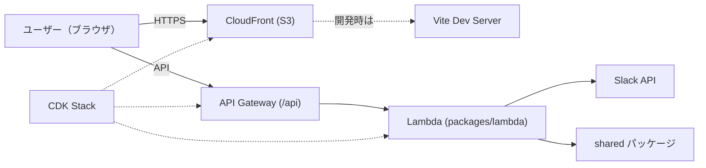

# Slack 出退勤打刻アプリ

## このプロジェクトとは？

- **概要**: Slack と連携してワンクリックで出勤・退勤メッセージを投稿する TypeScript 製のサーバーレスアプリです。フロントエンドは React + Vite、バックエンドは AWS Lambda（API Gateway 経由）で動作します。
- **主な機能**: 出退勤打刻、チャンネル選択、メッセージカスタマイズ、Slack OAuth（トークン管理含む）。
- **ターゲット**: 小〜中規模チームの手軽な勤怠打刻用途、および開発者の学習・デプロイ確認。

## 開発の始め方（Quick Start）

- **前提環境**:
  - Node.js (v24 推奨)
  - npm
  - AWS CLI（デプロイ時）
  - AWS SAM CLI（ローカル Lambda 起動時）

- **リポジトリ構成（要旨）**: `packages/web`, `packages/lambda`, `packages/cdk`, `packages/shared`（詳しくはルートの package.json を参照）

- **最短手順（ローカルで動かす）**

```bash
# 依存関係をインストール
npm install

# Lambda用 環境変数をコピーして編集
cp packages/lambda/env.example.json packages/lambda/env.json
# Web用 環境変数をコピーして編集
cp packages/web/.env.example packages/web/.env

# 共有ライブラリをビルド
npm run shared:build

# ローカル API を起動（SAM）
npm run sam:dev

# 別ターミナルでフロントを起動
npm run web:dev
```

- **よく使うスクリプト（ルート）**
  - `npm run web:dev` — フロント開発サーバ起動
  - `npm run sam:dev` — ローカル Lambda 起動（API: http://localhost:3000）
  - `npm run shared:build` — 共通パッケージのビルド
  - `npm run cdk:build` / `npm run cdk:deploy` — CDK ビルド・デプロイ

## アーキテクチャ図

CloudFront（+ WAF）で静的サイトを配信し、API は API Gateway → Lambda で Slack と通信します。ローカル開発では Vite と SAM を使って同等のフローを再現します。



## 補足（開発者向けショートリファレンス）

- **主要フォルダ**: [packages/web](packages/web), [packages/lambda](packages/lambda), [packages/cdk](packages/cdk), [packages/shared](packages/shared)
- **主要 API（例）**: `/api/auth/slack`（認証開始）、`/api/auth/slack/callback`（コールバック）、`/api/health`（ヘルス）
- **ローカル URL**: フロント `http://localhost:5173`、API `http://localhost:3000`

---

## デプロイ（本番環境へ）

以下は AWS CDK を使った本番デプロイの一般的な手順です。環境や CDK スタックの実装によって一部ステップが変わる場合があります。

前提:

- AWS アカウントと十分な IAM 権限（CloudFormation / S3 / CloudFront / Lambda / IAM の作成）があること
- `packages/lambda/env.json` に本番用の環境変数（Slack クライアント情報・CLIENT_URL 等）を設定しておくこと

基本手順（ルートで実行）:

```bash
# 依存関係をインストール
npm install

# 共有パッケージと Web のビルド
npm run shared:build
npm run web:build

# CDK のビルド
npm run cdk:build

# （初回のみ）CDK bootstrap — アカウント/リージョンを指定
# 例: npx cdk bootstrap aws://<ACCOUNT_ID>/<REGION>
npx --yes cdk bootstrap

# CDK を使ってデプロイ
npm run cdk:deploy
```

補足:

- `npm run web:build` により生成された静的ファイルを CDK が S3 にアップロードし、CloudFront に配置する構成が一般的です（プロジェクト実装に依存）。
- デプロイ完了時に CDK が出力する CloudFront ドメインや API Gateway のエンドポイントを Slack の Redirect URL（例: `https://<domain>/api/auth/slack/callback`）や `packages/lambda/env.json` の `CLIENT_URL` に反映してください。
- デプロイに失敗した場合は、CloudFormation のイベントログと CDK の出力を確認し、必要な IAM ポリシーや既存リソースの競合を確認してください。

スタックの削除（クリーンアップ）:

```bash
# スタックを削除してリソースを破棄
npm run cdk:destroy
```

運用メモ:

- 本番用の環境変数は誤ってコミットしないよう注意してください。シークレット管理には Secrets Manager や Parameter Store の利用を検討してください。
- デプロイ前に `packages/lambda/env.json` の `NODE_ENV` を `production` に設定することを検討してください。

---

## テスト実行方法

- 型チェック（ルート）:

```bash
npm run type-check
```

- Lint / Format:

```bash
npm run lint
npm run format:check
```

- パッケージ毎のテスト実行:
  - 各パッケージに `test` スクリプトがある場合、当該パッケージ直下で `npm test` を実行してください。
  - ルートからワークスペース指定で実行する例:

```bash
npm run test --workspace=packages/lambda
```
